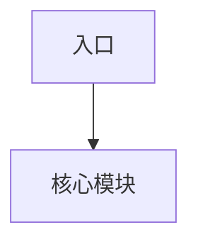

# 架构 - {{title}}

## 背景

- 系统：
- 业务目标：
- 技术约束：
- 非目标：

## 解决的问题

## 架构图

## 核心模块

| 模块 | 职责 | 边界 | 风险 |
|---|---|---|---|
|  |  |  |  |

## 关键流程

1. 
2. 
3. 

## Tradeoff

- 一致性 vs 可用性：
- 延迟 vs 吞吐：
- 简单性 vs 扩展性：
- 开发效率 vs 运行成本：

## 失败场景

- 

## 观测与验证

- 指标：
- 压测：
- 回归：
- 告警：

## 后续演化

- 

